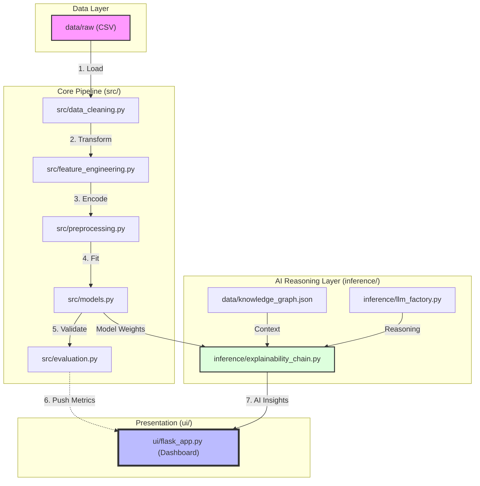

# Project Folder Structure & Pipeline Direction

This document provides an overview of the project structure and highlights the flow of the Dallas 311 Service Requests ML Pipeline.

## 📂 Folder Structure

```text
.
├── 📂 agents/                 # Autonomous AI agents for data refinement
│   ├── base_agent.py          # Base class for all agents
│   ├── data_prep_agent.py     # Agent for advanced data preparation
│   ├── diagnostics_agent.py   # Agent for pipeline diagnostics
│   └── ...
├── 📂 data/                   # Data storage layer
│   ├── 📂 raw/                # Original, untouched CSV data
│   ├── 📂 processed/          # Data after cleaning/engineering
│   ├── 📂 reports/            # Generated PDF/CSV analysis reports
│   └── knowledge_graph.json   # Graph metadata for RAG-based reasoning
├── 📂 inference/              # Real-time model application & explainability
│   ├── explainability_chain.py# LangChain-powered RAG/Insights logic
│   └── llm_factory.py         # LLM configuration (Groq/OpenAI/Gemini)
├── 📂 src/                    # Core pipeline logic (The Machine Room)
│   ├── data_loader.py         # 1. Ingestion
│   ├── data_cleaning.py       # 2. Cleaning
│   ├── feature_engineering.py  # 3. Engineering
│   ├── preprocessing.py       # 4. Processing (Encoding/Splitting)
│   ├── models.py              # 5. Training (RF, XGB, LR)
│   ├── evaluation.py          # 6. Metrics & Visualization
│   └── pipeline.py            # 🚀 Main Orchestrator for steps 1-6
├── 📂 ui/                     # User Interface & Dashboard
│   ├── flask_app.py           # Backend API for the dashboard
│   ├── dashboard.html         # Frontend visualization
│   └── app.py (streamlit)     # Alternative Streamlit interface
├── 📂 tests/                  # Integrity & Unit Tests
├── 📜 PRD.md                  # Project Requirements Document
├── 📜 2ndCyclePhases.md       # Roadmap for Cycle 2 implementation
└── 📜 .env                    # System credentials & configurations
```

---

## 🚀 Pipeline Flow Direction

The project follows a linear pipeline architecture, enriched by an **Expert AI Reasoning Layer** at the inference stage.



### Key Stages Explained:

1.  **Ingestion & Cleaning**: Raw 311 data is filtered for irrelevant columns and outliers.
2.  **Feature Engineering**: Temporal features (creation vs. closing time) are derived.
3.  **Preprocessing**: Categorical data is encoded (Target/Label encoding) and missing values are handled.
4.  **Training**: Random Forest and XGBoost models are trained to predict resolution latency.
5.  **Evaluation**: Precision, Recall, and AUC-ROC are calculated.
6.  **AI Explainability**: The `inference` layer uses a Knowledge Graph to explain *why* the model predicted a delay, using LLMs.
7.  **Dashboard**: The `ui` layer visualizes both the performance metrics and the AI-generated insights.
