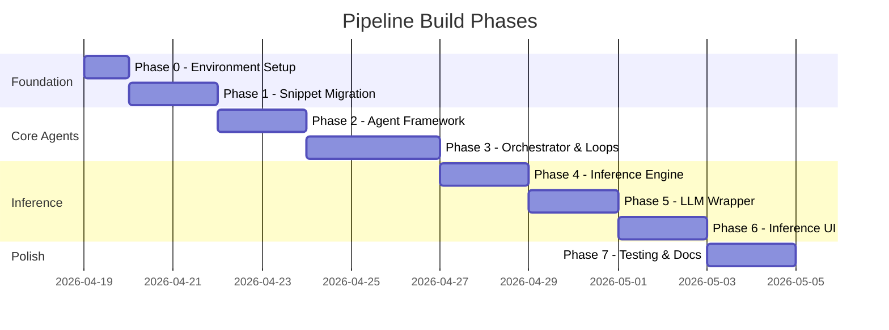

# Phases, Sub-Tasks & Completion Criteria

> Derived from [pythonAgentsPRD.md](file:///f:/MASTERS/SEM2/6302ASDS/Fina_final/pythonAgentsPRD.md)

---

## Phase 0 — Environment & Repository Scaffold

| # | Sub-Task | Completion Criteria |
|---|----------|---------------------|
| 0.1 | Create project directory structure (`agents/`, `orchestrator/`, `ui/`, `data/`, `tests/`, `notebooks/`) | All folders exist and contain an `__init__.py` where applicable |
| 0.2 | Initialize Python virtual environment (venv or conda) | Environment activates cleanly; `python --version` returns expected version |
| 0.3 | Create `requirements.txt` with core dependencies (`pandas`, `numpy`, `scipy`, `scikit-learn`, `statsmodels`, `streamlit`, `openai`/`langchain`) | `pip install -r requirements.txt` completes with zero errors |
| 0.4 | Set up `.gitignore` for Python artifacts, data files, and env folders | `.gitignore` committed; `git status` shows no untracked noise |
| 0.5 | Create a `config.py` or `.env` for shared constants (file paths, API keys, thresholds) | Config file is importable by all agents without hardcoded paths |

**Phase Gate:** Running `pip install -r requirements.txt && python -c "import pandas; import sklearn; import statsmodels"` succeeds.

---

## Phase 1 — Jupyter Notebook Snippet Migration

| # | Sub-Task | Completion Criteria |
|---|----------|---------------------|
| 1.1 | Audit all existing `.ipynb` files; catalog reusable cells by function (cleaning, transformation, diagnostics, modeling, regularization) | A checklist mapping each notebook cell → target agent module exists |
| 1.2 | Extract data cleaning / merging cells → `agents/data_prep_agent.py` | Functions run standalone on sample data and return a clean `DataFrame` |
| 1.3 | Extract transformation cells → `agents/transformation_agent.py` | Functions accept a `DataFrame`, apply transforms, and return a modified `DataFrame` |
| 1.4 | Extract diagnostic cells → `agents/diagnostics_agent.py` | Functions return a structured diagnostics report dict (e.g., `{"normality_pass": bool, "heteroscedasticity_detected": bool}`) |
| 1.5 | Extract model selection cells → `agents/model_selection_agent.py` | Functions accept data and return a ranked list of candidate models with BIC/AIC scores |
| 1.6 | Extract regularization cells → `agents/regularization_agent.py` | Functions fit Ridge/LASSO/ElasticNet and return fitted model + coefficient summary |

**Phase Gate:** Each agent module can be imported and executed independently with test data. All extracted functions have docstrings and type hints.

---

## Phase 2 — Agent Base Class & Standardized Interface

| # | Sub-Task | Completion Criteria |
|---|----------|---------------------|
| 2.1 | Design an abstract `BaseAgent` class with a common interface (`run()`, `validate()`, `report()`) | `BaseAgent` defined in `agents/base_agent.py`; enforces method signatures via `abc.ABC` |
| 2.2 | Refactor `DataPrepAgent` to inherit from `BaseAgent` | `DataPrepAgent.run(input_path)` returns a validated `DataFrame` |
| 2.3 | Refactor `TransformationAgent` to inherit from `BaseAgent` | `TransformationAgent.run(df)` returns transformed `DataFrame` + transformation metadata |
| 2.4 | Refactor `DiagnosticsAgent` to inherit from `BaseAgent` | `DiagnosticsAgent.run(df)` returns diagnostics dict; includes pass/fail flags |
| 2.5 | Refactor `ModelSelectionAgent` to inherit from `BaseAgent` | `ModelSelectionAgent.run(df)` returns best model object + selection metrics |
| 2.6 | Refactor `RegularizationAgent` to inherit from `BaseAgent` | `RegularizationAgent.run(model, df)` returns regularized model + final report |
| 2.7 | Write unit tests for each agent's `run()` and `validate()` methods | `pytest tests/` passes with ≥ 80% coverage on agent modules |

**Phase Gate:** `pytest tests/ -v` runs green. Every agent follows the `BaseAgent` contract.

---

## Phase 3 — Orchestrator & Feedback Loops

| # | Sub-Task | Completion Criteria |
|---|----------|---------------------|
| 3.1 | Build `orchestrator/task_planner.py` — sequential pipeline that chains agent `.run()` calls in order | Task Planner executes Data Prep → Transformation → Diagnostics → Model Selection → Regularization end-to-end on sample data |
| 3.2 | Implement **Transformation ↔ Diagnostics feedback loop**: if `DiagnosticsAgent` detects heteroscedasticity or non-normality, automatically re-invoke `TransformationAgent` with adjusted parameters | Loop triggers on simulated bad data; exits after normality passes OR a configurable max-iteration cap is reached |
| 3.3 | Build `orchestrator/critic_agent.py` — Critic / Verification Agent that evaluates final model metrics against acceptance thresholds | Critic returns `"APPROVE"` or `"REFINE"` signal; on `"REFINE"`, Task Planner re-runs the pipeline with adjusted config |
| 3.4 | Implement pipeline logging (per-agent execution time, input/output shapes, diagnostic results) | Each run produces a structured JSON log file in `logs/` |
| 3.5 | Implement error handling and graceful degradation (e.g., agent timeout, data schema mismatch) | Pipeline logs errors and halts cleanly instead of crashing silently |

**Phase Gate:** A full end-to-end pipeline run completes on real data. The feedback loop demonstrably triggers at least once during a test run with intentionally skewed data. JSON logs are written.

---

## Phase 4 — Inference Engine

| # | Sub-Task | Completion Criteria |
|---|----------|---------------------|
| 4.1 | Build `inference/engine.py` — loads the approved model artifact and exposes a `predict(input_data)` function | `predict()` accepts a dict or DataFrame row and returns a prediction + confidence interval |
| 4.2 | Serialize/deserialize the final model (e.g., `joblib` or `pickle`) | Model saves to `models/` directory and reloads identically |
| 4.3 | Write integration test: full pipeline → saved model → inference on new data | Test passes; prediction output matches expected type and range |

**Phase Gate:** Inference engine loads a saved model and returns predictions on unseen data without re-running the training pipeline.

---

## Phase 5 — LLM Wrapper & Explainability Layer

| # | Sub-Task | Completion Criteria |
|---|----------|---------------------|
| 5.1 | Build `inference/llm_wrapper.py` — accepts model coefficients, feature importances, and a prediction; returns a natural-language explanation | Function returns a coherent English paragraph explaining the prediction drivers |
| 5.2 | Integrate with LLM API (OpenAI / Gemini / local Llama) via `openai` or `langchain` | API call succeeds and returns a well-formed explanation string |
| 5.3 | Design the prompt template that feeds model context to the LLM (coefficients, variable names, data summary stats) | Prompt template is parameterized, version-controlled, and produces consistent output quality |
| 5.4 | Add explanation caching to avoid redundant API calls for identical inputs | Repeated identical inputs return cached explanations without hitting the API |

**Phase Gate:** Given a prediction result, the LLM wrapper produces a human-readable, accurate narrative referencing actual model variables and their contributions.

---

## Phase 6 — Inference UI (Streamlit / Gradio)

| # | Sub-Task | Completion Criteria |
|---|----------|---------------------|
| 6.1 | Scaffold `ui/app.py` with Streamlit (or Gradio) | `streamlit run ui/app.py` launches without errors |
| 6.2 | Build input form: users can enter feature values for a new prediction | All model input features are represented as input widgets with sensible defaults |
| 6.3 | Wire the "Predict" button to `inference/engine.py` → display raw prediction result | Clicking "Predict" shows the numerical prediction on-screen |
| 6.4 | Wire the "Explain" button to `inference/llm_wrapper.py` → display LLM narrative | Clicking "Explain" renders the natural-language explanation below the prediction |
| 6.5 | Add visualization panel: show feature importance bar chart and residual plots | Charts render dynamically based on the current model |
| 6.6 | Style the UI — dark theme, clear typography, responsive layout | UI is visually polished and usable on both desktop and tablet viewports |

**Phase Gate:** A non-technical user can open the UI, enter values, receive a prediction, and read a plain-English explanation of what drove it.

---

## Phase 7 — Integration Testing & Documentation

| # | Sub-Task | Completion Criteria |
|---|----------|---------------------|
| 7.1 | End-to-end integration test: raw CSV → pipeline → model artifact → inference → LLM explanation | Single command triggers the full flow and produces a final explanation string |
| 7.2 | Write `README.md` with setup instructions, architecture diagram, and usage examples | A new contributor can set up and run the project following only the README |
| 7.3 | Document each agent's API in docstrings and an `api_reference.md` | Every public method has a docstring; API reference is generated or written |
| 7.4 | Performance benchmarking: measure pipeline runtime on varying dataset sizes | Benchmark results recorded; bottlenecks identified |

**Phase Gate:** Project is reproducible from a fresh clone. All tests pass. Documentation is complete.

---

## Phase Summary

